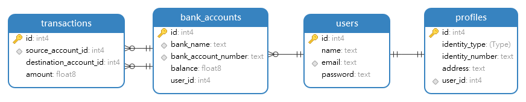
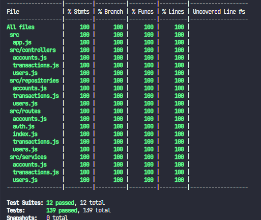

<h1 align="center">
  Chapter 4
</h1>

# ERD

# Unit & Integration Testing Coverage

# How to running this project?

1. contents of the .env file according to example
2. running this command `npm run install`
3. running this command to running this project `npm run start:dev`
4. import thunder client collection
5. running this command to seed the database `npm run prisma:seed`
6. api documentation: `http://localhost:{PORT}/api/v1/docs`
7. running this command to testing:`npm run test`

# Deployment API - Banking System

[api documentation](https://euphoric-world-440804-k1.et.r.appspot.com/api/v1/docs/)

# Tools Version

1. Node: v20.10.0
2. postgres: postgres (PostgreSQL) 16.1
3. npm: 10.9.0

# Profile

|                  |                                      |
| ---------------- | ------------------------------------ |
| ID Peserta       | **BES2409KM7023**                    |
| Nama Peserta     | **Viery Nugroho**                    |
|                  |                                      |
| Kelas            | **BEJS 1**                           |
|                  |                                      |
| ID Fasil         | **F-BEE24001186**                    |
| Nama Fasilitator | **Mughie Arief Mughoni Satyakusuma** |
|                  |                                      |

# Backend Javascript

### KM x Binar Academy Batch 7

|                                                                            |
| -------------------------------------------------------------------------- |
| **Notes**                                                                  |
| Banking_System.js using raw query implementation                           |
| Banking_System using database chapter 3 (in folder /db)                    |
| API DOCS: (https://euphoric-world-440804-k1.et.r.appspot.com/api/v1/docs/) |
