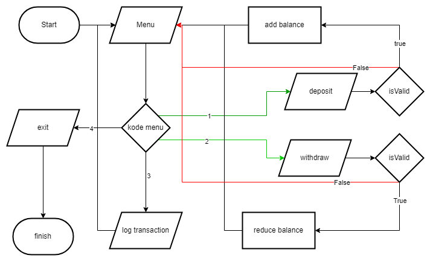

<h1 align="center">
  Chapter 2 - Basic-Banking-System
</h1>

# HOW TO RUNNING THIS PROJECT

1. ` node bank_account.js`

# Data Diri

|                  |                                      |
| ---------------- | ------------------------------------ |
| ID Peserta       | **BES2409KM7023**                    |
| Nama Peserta     | **Viery Nugroho**                    |
|                  |                                      |
| Kelas            | **BEJS 1**                           |
|                  |                                      |
| ID Fasil         | **F-BEE24001186**                    |
| Nama Fasilitator | **Mughie Arief Mughoni Satyakusuma** |
|                  |                                      |

# Backend Javascript

### KM x Binar Academy Batch 7

|                      |
| -------------------- |
| **Catatan**          |
| Submission Chapter 2 |
